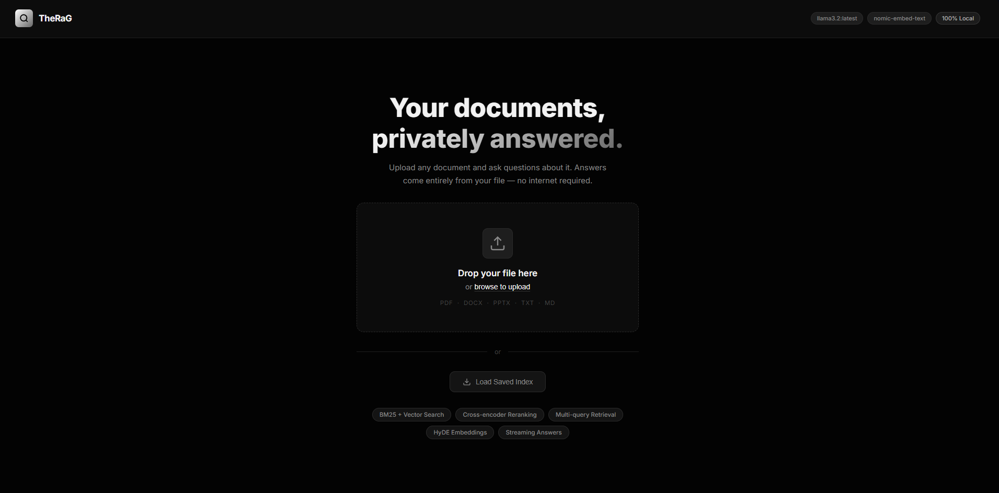
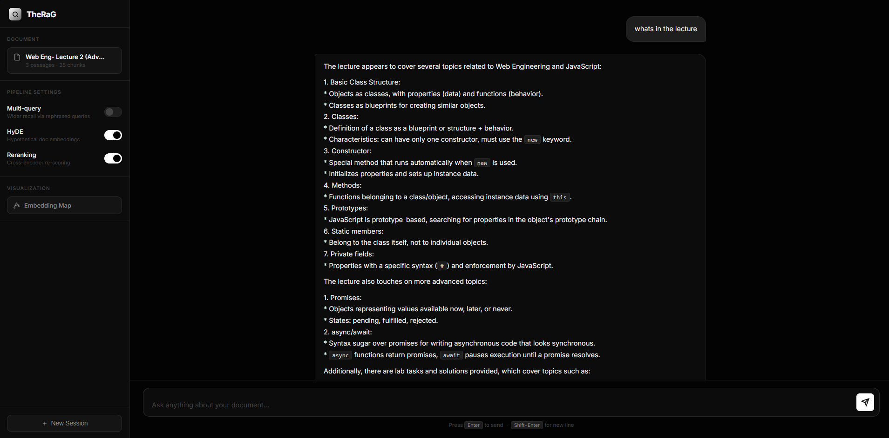
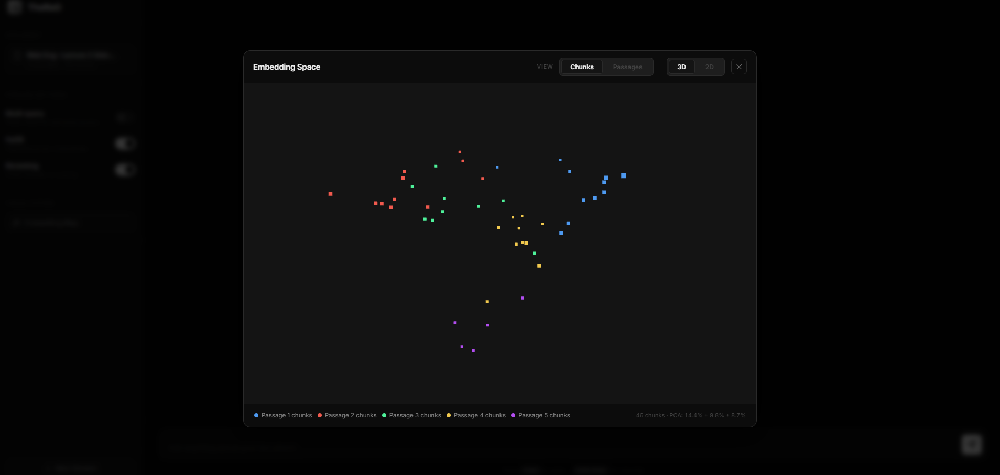
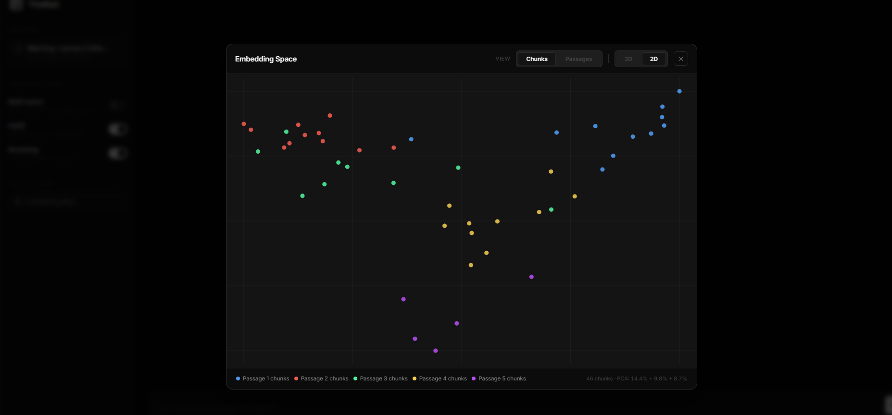

<div align="center">

<h1>TheRaG</h1>
<p><strong>Your documents, privately answered.</strong></p>

<p>
  A fully local Retrieval-Augmented Generation system — upload any document and ask questions about it.<br>
  No API keys. No data leaves your machine. 100% offline.
</p>

<p>
  
  
  
  
  
</p>

</div>

---

## Screenshots

<div align="center">
  
  <br/><em>Upload any document to get started</em>
</div>

<br/>

<div align="center">
  
  <br/><em>Streaming answers with source citations and confidence scoring</em>
</div>

<br/>

<table>
  <tr>
    <td align="center">
      
      <br/><em>Embedding Space — 3D view</em>
    </td>
    <td align="center">
      
      <br/><em>Embedding Space — 2D view</em>
    </td>
  </tr>
</table>

---

## Features

| Feature | Description |
|---|---|
| **100% Local** | All processing happens on your machine — no cloud calls |
| **Multi-format** | PDF, DOCX, PPTX, TXT, MD |
| **Small-to-Big Chunking** | Child chunks for precision retrieval, parent chunks for LLM context |
| **Hybrid Search** | BM25 keyword search + vector similarity, fused together |
| **HyDE** | Hypothetical Document Embeddings for query expansion |
| **Multi-Query** | Generates alternative phrasings to improve recall |
| **Cross-Encoder Reranking** | `BAAI/bge-reranker-v2-m3` re-scores candidates for maximum precision |
| **Streaming Answers** | Token-by-token streaming via Server-Sent Events |
| **Confidence Score** | Weighted score from similarity, LLM self-eval, and ROUGE-L |
| **Embedding Visualiser** | Interactive 3D/2D PCA scatter plot of your document's chunk space |

---

## Architecture

```
Document Upload
      │
      ▼
┌─────────────────────────────────────────────┐
│               Ingestion Pipeline            │
│  Read → Clean → Small-to-Big Chunk          │
│  → Embed (Ollama) → ChromaDB + BM25         │
└─────────────────────────────────────────────┘
      │
      ▼  (query time)
┌─────────────────────────────────────────────┐
│               Query Pipeline                │
│                                             │
│  User Question                              │
│       ├─► HyDE expansion                   │
│       └─► Multi-query generation           │
│                    │                        │
│                    ▼                        │
│         Hybrid Retrieval (BM25 + Vector)    │
│                    │                        │
│                    ▼                        │
│         Cross-Encoder Reranking             │
│                    │                        │
│                    ▼                        │
│         Parent-chunk promotion              │
│                    │                        │
│                    ▼                        │
│         Ollama LLM  →  Streaming Answer     │
└─────────────────────────────────────────────┘
```

---

## Tech Stack

- **[FastAPI](https://fastapi.tiangolo.com/)** — async web framework and REST API
- **[LlamaIndex](https://www.llamaindex.ai/)** — RAG orchestration and node management
- **[ChromaDB](https://www.trychroma.com/)** — persistent vector store
- **[Ollama](https://ollama.com/)** — local LLM and embedding inference
- **[sentence-transformers](https://www.sbert.net/)** — cross-encoder reranking
- **[rank-bm25](https://github.com/dorianbrown/rank_bm25)** — BM25 keyword search
- **[scikit-learn](https://scikit-learn.org/)** — PCA for embedding visualisation

---

## Quick Start — Docker (recommended)

### Prerequisites
- [Docker](https://docs.docker.com/get-docker/) and Docker Compose installed
- At least **8 GB RAM** (16 GB recommended)

```bash
# 1. Clone the repository
git clone https://github.com/your-username/TheRaG.git
cd TheRaG

# 2. Start all services (Ollama + TheRaG)
#    First run pulls the LLM and embedding models (~3 GB)
docker compose up --build

# 3. Open the app
open http://localhost:8000
```

> **Note:** The `ollama-setup` container automatically pulls `llama3.2:latest` and `nomic-embed-text` on first start. Subsequent starts reuse the cached models from the `ollama_models` volume.

---

## Quick Start — Local Development

### Prerequisites
- Python 3.11+
- [Ollama](https://ollama.com/download) installed and running

```bash
# 1. Pull the required models
ollama pull llama3.2:latest
ollama pull nomic-embed-text

# 2. Clone and set up environment
git clone https://github.com/your-username/TheRaG.git
cd TheRaG

python -m venv venv
source venv/bin/activate          # Windows: venv\Scripts\activate

pip install -r requirements.txt

# 3. (Optional) configure environment
cp .env.example .env
# Edit .env if your Ollama runs on a different host/port

# 4. Run
python app.py
# App opens automatically at http://localhost:8000
```

---

## Configuration

All settings are environment variables. Copy `.env.example` to `.env` and adjust:

| Variable | Default | Description |
|---|---|---|
| `OLLAMA_URL` | `http://localhost:11434` | Ollama server URL |
| `LLM_MODEL` | `llama3.2:latest` | Chat model to use |
| `EMBEDDING_MODEL` | `nomic-embed-text` | Embedding model |
| `PORT` | `8000` | Web server port (HF Spaces uses `7860`) |
| `REQUEST_TIMEOUT` | `180.0` | Ollama request timeout in seconds |

Advanced settings (edit `config/settings.py`):

| Setting | Default | Description |
|---|---|---|
| `PARENT_CHUNK_SIZE` | `1024` | Tokens per parent chunk (fed to LLM) |
| `CHILD_CHUNK_SIZE` | `128` | Tokens per child chunk (indexed for retrieval) |
| `TOP_K_RETRIEVAL` | `20` | Candidate chunks before reranking |
| `TOP_K_RERANK` | `5` | Final chunks the LLM sees |
| `ENABLE_HYDE` | `True` | HyDE query expansion |
| `ENABLE_MULTI_QUERY` | `True` | Multi-query retrieval |
| `ENABLE_RERANKING` | `True` | Cross-encoder reranking |

---

## Project Structure

```
TheRaG/
├── app.py                    # FastAPI server — routes and state
├── config/
│   └── settings.py           # All tuneable parameters
├── entrypoint/
│   ├── ingest.py             # Document ingestion pipeline
│   └── query.py              # Streaming query pipeline
├── src/pipelines/
│   ├── chunking_pipeline.py  # Small-to-big chunking
│   ├── retrieval_pipeline.py # Hybrid BM25 + vector search
│   ├── reranking_pipeline.py # Cross-encoder reranking
│   ├── generation_pipeline.py# LLM answer generation
│   ├── hyde.py               # HyDE query expansion
│   └── multi_query.py        # Alternative query generation
├── templates/
│   └── index.html            # Frontend UI (Jinja2)
├── static/
│   ├── app.js                # Frontend JavaScript
│   └── style.css             # Styles
├── tests/
│   ├── unit/                 # Unit tests
│   └── integration/          # Integration tests
├── evals/                    # Evaluation scripts and datasets
├── images/                   # Screenshots for documentation
├── data/                     # Runtime data (gitignored)
│   ├── raw/                  # Uploaded documents
│   ├── processed/            # BM25 index and node caches
│   └── vector_store/         # ChromaDB embeddings
├── Dockerfile
├── docker-compose.yml
├── requirements.txt
└── .env.example
```

---

## Deployment on Hugging Face Spaces

TheRaG is compatible with HF Spaces (Docker SDK):

1. Fork this repository
2. Create a new Space → **Docker** SDK
3. Connect your forked repo
4. Add these Space secrets:
   - `OLLAMA_URL` — URL of an externally hosted Ollama instance
   - `LLM_MODEL` — model name
   - `EMBEDDING_MODEL` — embedding model name
5. Set `PORT=7860` (already the Dockerfile default for HF)

> HF Spaces does not provide GPU by default. Use a CPU-compatible model such as `llama3.2:1b` or `tinyllama` for best performance.

---

## Running Tests

```bash
# Unit tests
python -m pytest tests/unit/ -v

# Integration tests (requires Ollama running)
python -m pytest tests/integration/ -v
```

---

## License

MIT — see [LICENSE](LICENSE) for details.
